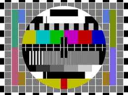

Awesome Feature B (header 1)
============================

An automated numbered list (header 2)
-------------------------------------
#. one
#. two
#. three

A link (header 3)
^^^^^^^^^^^^^^^^^^^^^
`A link <https://www.github.com/apjansen/groco>`_

An image
"""""""""""""

A table:

======  =====
col1    col2
======  =====
1       a
2       b
3       c
======  =====

A code block:::

    def square(x):
        return x**2

Some math:

This is an inline equation embedded :math:`a^2 + b^2 = c^2` in text.